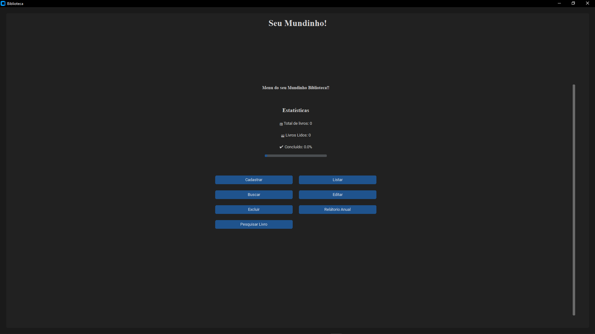
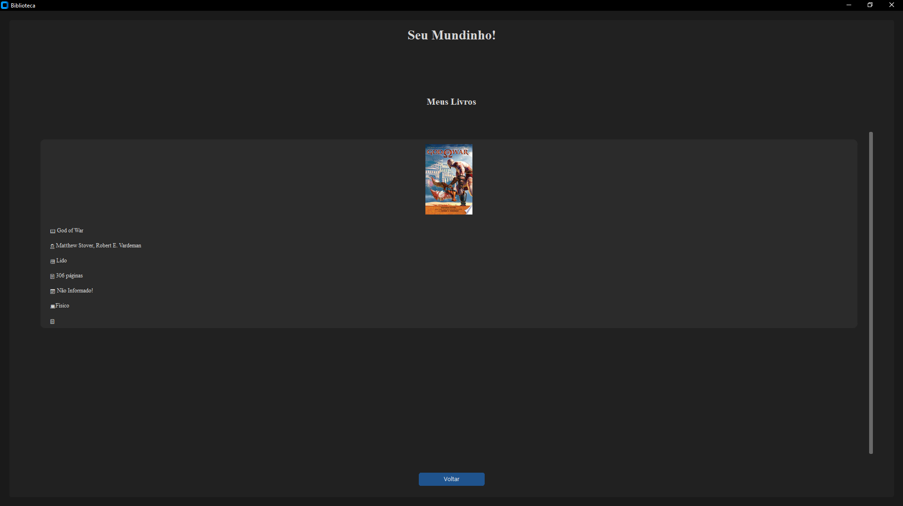

# 📚 Biblioteca

Sistema de gerenciamento de biblioteca pessoal desenvolvido em Python.

O projeto tem como objetivo centralizar e organizar as informações de uma biblioteca pessoal, facilitando o cadastro, a consulta e o gerenciamento dos livros.

O sistema foi desenvolvido como parte dos meus estudos em programação, com o objetivo de aprimorar minha lógica, aprofundar meus conhecimentos em Python e aplicar esses conceitos na solução de um problema real de organização e gerenciamento de livros.

## 🚀 Funcionalidades

O sistema permite o gerenciamento de uma biblioteca pessoal aplicando as operações de CRUD.

- 📖 Cadastrar novos livros
- 📋 Listar os livros cadastrados
- 🔎 Buscar livros por título ou ID
- ✏️ Editar informações dos livros
- 🗑️ Excluir livros
- 📚 Definir o status de leitura como:
  - Lido
  - Lendo
  - Não Lido
- 💻 Definir o formato de livro como:
  - Físico
  - E-book
- Relatório de Busca de livros lidos por ano
- Pesquisar Livros e adicionar a biblioteca online

## 🛠️ Tecnologias utilizadas

- **Python** — linguagem principal utilizada no desenvolvimento
- **SQLite** — banco de dados utilizado para armazenar os livros
- **CustomTkinter** — criação da interface gráfica
- **Git** — controle de versão do projeto
- **GitHub** — hospedagem e gerenciamento do repositório
- **Google Books API** — pesquisa de livros e obtenção de metadados e capas 


## ▶️ Como executar o projeto

### 1. Clone o repositório

```bash
git clone https://github.com/Vinicius120824/Biblioteca.git
```

### 2. Acesse a pasta do projeto

```bash
cd Biblioteca
```

### 3. Crie um ambiente virtual

```bash
python -m venv .venv
```

### 4. Ative o ambiente virtual

No PowerShell:

```powershell
.\.venv\Scripts\Activate.ps1
```

### 5. Instale as dependências

```bash
pip install -r requirements.txt
```

### 6. Execute o projeto

```bash
python main.py
```

## 🖼️ Interface

### Tela principal



### Meus livros



### Pesquisa com Google Books

